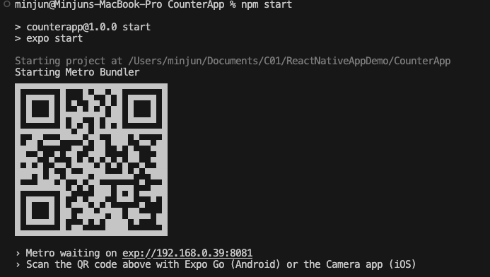
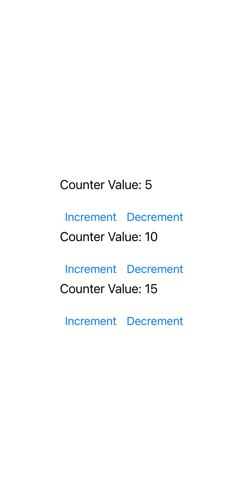
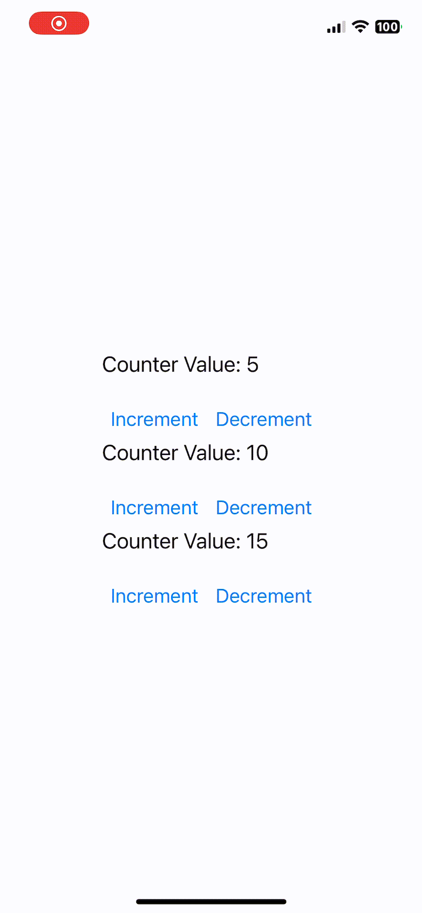

# <span style="color:#ADD8E6">Creating your First React Native App</span>

<div align="right"> </div>

In this lab, you will learn how to build a simple React Native application and you will recreate a version of your own.

React Native is a framework for building native apps for IOS/Android using JavaScript.

There are two ways of building a React Native app: Expo CLI and React Native CLI.
We will be using Expo CLI for simplicity and ease of use.

<a id="notes"></a>
### <span style="color:#ADD8E6"> Prerequisites </span> 
1. Make sure you have Node.js installed.
You can install from the official website: https://nodejs.org/en/download/
2. An IDE. We will use VS Code.
3. Expo Go installed on your mobile device. Available both on IOS and Android: https://expo.dev/client

<a id="notes"></a>
### <span style="color:#ADD8E6">Step 2: Setting up the new app </span> 
Open a terminal in VS Code and install Expo CLI with the following command:
```shell
npm install -g expo-cli
```

Now, create a new expo project
```shell
npx create-expo-app CounterApp
cd CounterApp
```
Replace CounterApp with your own app name.

Once complete, run the following command to start the server:
```shell
npm start
```


It should create a QR code that you can scan with your phone.
Make sure your phone is connected to the same network as your computer. 


<div style="text-align:center">
  

  <p>
  This is what you should see on your phone.
  </p>
</div>
In case you face a loading problem, run the following commands:

```shell
npm install -g expo-cli
expo-cli start --tunnel
```
which globally installs the expo client in our application.

<a id="step3"></a>
### <span style="color:#ADD8E6">Step 3: Designing the App </span> 

In App.js, change the text inside `<Text> ... </Text>` then save the file or reload the app. You should see the change on your device.

We will create a simple counter app.

Begin by creating a functional component `Counter.js`. In the root directory, make a sub directory called 'components'. `Counter.js` will be inside `components`.

```jsx

import React, { useState } from 'react';
import { View, Text, Button, StyleSheet } from 'react-native';

export default Counter;
```

We will initally include the import statements and export statement for our functional component.
Notice we are using a state hook and several components from React Native package.

```jsx

import React, { useState } from 'react';
import { View, Text, Button, StyleSheet } from 'react-native';

const Counter = ({ initialValues }) => {

};

export default Counter;
```

We will define the functional component `Counter` using arrow function syntax and destructing the `initialValues` prompt.


```jsx

import React, { useState } from 'react';
import { View, Text, Button, StyleSheet } from 'react-native';

const Counter = ({ initialValues }) => {
  return (
    <View style={styles.container}>
    </View>
  );
};

const styles = StyleSheet.create({
  container: {
    alignItems: 'center',
    marginTop: 50,
  }
});

export default Counter;
```

Now, we have a return statment that defines the structure that the component will render. We use the `StyleSheet` api for creating styles. Check the documentation here: https://reactnative.dev/docs/stylesheet

To learn more about React Native's core components and apis, please refer to: https://reactnative.dev/docs/components-and-apis

```jsx

import React, { useState } from 'react';
import { View, Text, Button, StyleSheet } from 'react-native';

const Counter = ({ initialValues }) => {
  const [counters, setCounters] = useState(initialValues.map((value) => ({ id: uuidv4(), count: value })));

  return (
    <View style={styles.container}>
    </View>
  );
};

const styles = StyleSheet.create({
  container: {
    alignItems: 'center',
    marginTop: 50,
  }
});

export default Counter;
```

The newly added line of code, we use the `useState` React hook with the state variable `counters` and state setter `setCounters`.
We initialize an array of objects to counters, where each object is a counter with a unique `id` generated by `uuidv4()` and `count` that holds a value from the `initialValues` prompt.

The `map` method takes each value in the array and map it to an id and a count value.

Modify App.js as follows:

```jsx
import { StatusBar } from 'expo-status-bar';
import { StyleSheet, View } from 'react-native';
import Counter from './components/Counter';

export default function App() {
  return (
    <View style={styles.container}>
        <Counter initialValues={[5, 10, 15]} />
        <StatusBar style="auto" />
    </View>
  );
}

const styles = StyleSheet.create({
  container: {
    flex: 1,
    backgroundColor: '#fff',
    alignItems: 'center',
    justifyContent: 'center',
  },
});
```
We have imported the functional component Counter from components and included the Counter component in our render with the prop `initialValues` passed as an array `[5, 10, 15]`. It is important to note that this is where we pass in our prompt.

Now in Counter.js, we add the following code to display the Counters.

```jsx

import React, { useState } from 'react';
import { View, Text, Button, StyleSheet } from 'react-native';

const Counter = ({ initialValues }) => {
  const [counters, setCounters] = useState(initialValues.map((value) => ({ id: uuidv4(), count: value })));

  return (
    <View style={styles.container}>
      {counters.map((counter) => (
        <View key={counter.id}>
          <Text style={styles.text}>Counter Value: {counter.count}</Text>
          <View style={styles.buttonContainer}>
            <Button title="Increment" onPress={() => increment(counter.id)} />
            <Button title="Decrement" onPress={() => decrement(counter.id)} />
          </View>
        </View>
      ))}
    </View>
  );
};

const styles = StyleSheet.create({
  container: {
    alignItems: 'center',
    marginTop: 50,
  },
  text: {
    fontSize: 20,
    marginBottom: 20,
  },
  buttonContainer: {
    flexDirection: 'row',
  },
});

export default Counter;
```

Here, we use `map` to iterate over each element in the `counters` state variable and render React Native components for each counter.

We set `key={counter.id}` to provide an id for React to update and re-render components efficiently.

Using the `Text` component, we display the counter's value with its `count`.
Then, we have a View for the two buttons: Increment and Decrement. 

The onPress prop is used to specify the functions `increment` and `decrement` to be executed when the buttons are pressed.

We also updated the `styles` object to include stlying for text and buttonContainer.
The `flexDirection: 'row'` makes the buttons go side by side horizontally.

<div style="text-align:center">
  

  <p>
  This is what our App should look like at this stage:
  </p>
</div>

Now, the last thing we have left is to implement the `increment` and `decrement` helper functions.

We define the increment function as follows:
```jsx
const increment = (id) => {
  setCounters((prevCounters) =>
    prevCounters.map((counter) =>
      counter.id === id ? { ...counter, count: counter.count + 1 } : counter
    )
  );
};
```

The array function takes an id and sets the state using `setCounters` defined earlier above. The `prevCounters` is the previous state that React keeps track of, and in fact, the naming is dependent on the developer. It doesn't have to be called `setCounters`. React will know and treat it as the previous state.

Now, we iterate over each `counter` in the previous state using `map()`. Once we find the `id` that was passed into the function, we update the counter's count by one. Otherwise, we return the counter unchanged.

Here are some thing to note:

We use the ternary operator to check for the condition. 
```jsx
condition ? action1 : action2
```
If the condition is true, we perform action1. Otherwise, we perform action2.

`...` used in `...counter` is a spread operator that copies all properies of the current counter but with its `count` property incremented.

```jsx
const decrement = (id) => {
  setCounters((prevCounters) =>
    prevCounters.map((counter) =>
      counter.id === id ? { ...counter, count: counter.count - 1 } : counter
    )
  );
};
```

The `decrement` function is implemented almost the same way, except we subtract 1 from `counter.count`.

This concludes our basic implementation of `Counter.js` component.

<div style="text-align:center">
  
</div>

The code is available in the GitHub Repo: 


Now it's your turn to make your own app!