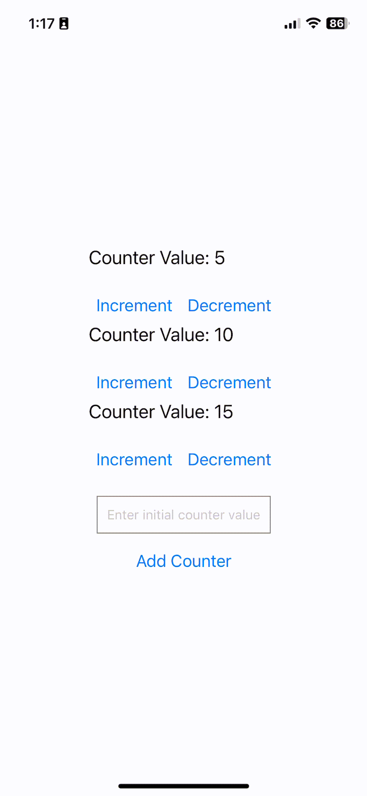

# <span style="color:#ADD8E6">Creating your First React Native App</span>

<div align="right"> </div>

## <span style="color:#ADD8E6">Table of Contents </span> 
  - [Description](#desc)
  - [Prerequisites](#pre)
  - [Designing the App](#design)
    - [`Counter.js`](#counter)
    - [`AddCounterForm.js`](#add)
    - [`App.js`](#app)
  - [Your Task](#task)
  - [Common Problems](#problems)

<a id="desc"></a>
### <span style="color:#ADD8E6"> Description </span> 

In this lab, you will learn how to build a simple React Native application and you will recreate a version of your own.

React Native is a framework for building native apps for IOS/Android using JavaScript.

There are two ways of building a React Native app: Expo CLI and React Native CLI.
We will be using Expo CLI for simplicity and ease of use.

Please refer to React Native documentation for its Core Components and APIs: https://reactnative.dev/docs/components-and-apis

If there are any issues or inaccuracies, please contribute by raising issues, making pull requests, or asking on Piazza. Thanks!

<a id="pre"></a>
### <span style="color:#ADD8E6"> Prerequisites </span> 
1. Make sure you have Node.js installed.
You can install from the official website: https://nodejs.org/en/download/
2. An IDE. We will use VS Code.
3. Expo Go installed on your mobile device. Available both on IOS and Android: https://expo.dev/client

<a id="step1"></a>
### <span style="color:#ADD8E6">Step 1: Setting up the new app </span> 
Open a terminal in VS Code and install Expo CLI with the following command:
```shell
npm install -g expo-cli
```

Now, create a new expo project
```shell
npx create-expo-app CounterApp
cd CounterApp
```
Replace CounterApp with your own app name.

Once complete, run the following command to start the server:
```shell
npm start
```


It should create a QR code that you can scan with your phone.
Make sure your phone is connected to the same network as your computer. 


<p align="center">
  

  <p align="center">
  This is what you should see on your phone.
  </p>
</p>
In case you face a loading problem, run the following commands:

```shell
npm install -g expo-cli
expo-cli start --tunnel
```
which globally installs the expo client in our application.

<a id="design"></a>
### <span style="color:#ADD8E6">Designing the App </span> 

In App.js, change the text inside `<Text> ... </Text>` then save the file or reload the app. You should see the change on your device.

We will create a simple counter app.

<a id="counter"></a>
#### <span style="color:#ADD8E6"> Counter.js </span> 

Begin by creating a functional component `Counter.js`. In the root directory, make a sub directory called 'components'. `Counter.js` will be inside `components`.

Make sure you install the following packages on your terminal:

```shell
npm install react
npm install react-native
npm install uuid
```

For issues with uuid on Android, please check the common problems section: [Common Problems](#problems)

```jsx

import React, { useState } from 'react';
import { View, Text, Button, StyleSheet } from 'react-native';

export default Counter;
```

We will initally include the import statements and export statement for our functional component.
Notice we are using a state hook and several components from React Native package.

```jsx

import React, { useState } from 'react';
import { View, Text, Button, StyleSheet } from 'react-native';

const Counter = ({ initialValues }) => {

};

export default Counter;
```

We will define the functional component `Counter` using arrow function syntax and destructing the `initialValues` prop.


```jsx

import React, { useState } from 'react';
import { View, Text, Button, StyleSheet } from 'react-native';

const Counter = ({ initialValues }) => {
  return (
    <View style={styles.container}>
    </View>
  );
};

const styles = StyleSheet.create({
  container: {
    alignItems: 'center',
    marginTop: 50,
  }
});

export default Counter;
```

Now, we have a return statment that defines the structure that the component will render. We use the `StyleSheet` api for creating styles. Check the documentation here: https://reactnative.dev/docs/stylesheet

To learn more about React Native's core components and apis, please refer to: https://reactnative.dev/docs/components-and-apis

```jsx

import React, { useState } from 'react';
import { View, Text, Button, StyleSheet } from 'react-native';

const Counter = ({ initialValues }) => {
  const [counters, setCounters] = useState(initialValues.map((value) => ({ id: uuidv4(), count: value })));

  return (
    <View style={styles.container}>
    </View>
  );
};

const styles = StyleSheet.create({
  container: {
    alignItems: 'center',
    marginTop: 50,
  }
});

export default Counter;
```

The newly added line of code, we use the `useState` React hook with the state variable `counters` and state setter `setCounters`.
We initialize an array of objects to counters, where each object is a counter with a unique `id` generated by `uuidv4()` and `count` that holds a value from the `initialValues` prop.

The `map` method takes each value in the array and map it to an id and a count value.

Modify App.js as follows:

```jsx
import { StatusBar } from 'expo-status-bar';
import { StyleSheet, View } from 'react-native';
import Counter from './components/Counter';

export default function App() {
  return (
    <View style={styles.container}>
        <Counter initialValues={[5, 10, 15]} />
        <StatusBar style="auto" />
    </View>
  );
}

const styles = StyleSheet.create({
  container: {
    flex: 1,
    backgroundColor: '#fff',
    alignItems: 'center',
    justifyContent: 'center',
  },
});
```
We have imported the functional component Counter from components and included the Counter component in our render with the prop `initialValues` passed as an array `[5, 10, 15]`. It is important to note that this is where we pass in our prompt.

Now in Counter.js, we add the following code to display the Counters.

```jsx

import React, { useState } from 'react';
import { View, Text, Button, StyleSheet } from 'react-native';

const Counter = ({ initialValues }) => {
  const [counters, setCounters] = useState(initialValues.map((value) => ({ id: uuidv4(), count: value })));

  return (
    <View style={styles.container}>
      {counters.map((counter) => (
        <View key={counter.id}>
          <Text style={styles.text}>Counter Value: {counter.count}</Text>
          <View style={styles.buttonContainer}>
            <Button title="Increment" onPress={() => increment(counter.id)} />
            <Button title="Decrement" onPress={() => decrement(counter.id)} />
          </View>
        </View>
      ))}
    </View>
  );
};

const styles = StyleSheet.create({
  container: {
    alignItems: 'center',
    marginTop: 50,
  },
  text: {
    fontSize: 20,
    marginBottom: 20,
  },
  buttonContainer: {
    flexDirection: 'row',
  },
});

export default Counter;
```

Here, we use `map` to iterate over each element in the `counters` state variable and render React Native components for each counter.

We set `key={counter.id}` to provide an id for React to update and re-render components efficiently.

Using the `Text` component, we display the counter's value with its `count`.
Then, we have a View for the two buttons: Increment and Decrement. 

The onPress prop is used to specify the functions `increment` and `decrement` to be executed when the buttons are pressed.

We also updated the `styles` object to include stlying for text and buttonContainer.
The `flexDirection: 'row'` makes the buttons go side by side horizontally.

<p align="center">
  

  <p align="center">
  This is what our App should look like at this stage:
  </p>
</p>

Additionally, we include the following lines of code to set the default value of our prop if it's not explicitly provided.

```jsx
Counter.defaultProps = {
  initialValues: [0],
};
```
This means there is one counter with the value 0. 


Now, the next thing we have left is to implement the `increment` and `decrement` helper functions.
We define the increment function as follows:
```jsx
const increment = (id) => {
  setCounters((prevCounters) =>
    prevCounters.map((counter) =>
      counter.id === id ? { ...counter, count: counter.count + 1 } : counter
    )
  );
};
```

The array function takes an id and sets the state using `setCounters` defined earlier above. The `prevCounters` is the previous state that React keeps track of, and in fact, the naming is dependent on the developer. It doesn't have to be called `setCounters`. React will know and treat it as the previous state.

Now, we iterate over each `counter` in the previous state using `map()`. Once we find the `id` that was passed into the function, we update the counter's count by one. Otherwise, we return the counter unchanged.

Here are some thing to note:

We use the ternary operator to check for the condition. 
```jsx
condition ? action1 : action2
```
If the condition is true, we perform action1. Otherwise, we perform action2.

`...` used in `...counter` is a spread operator that copies all properies of the current counter but with its `count` property incremented.

```jsx
const decrement = (id) => {
  setCounters((prevCounters) =>
    prevCounters.map((counter) =>
      counter.id === id ? { ...counter, count: counter.count - 1 } : counter
    )
  );
};
```

The `decrement` function is implemented almost the same way, except we subtract 1 from `counter.count`.

<p align="center">
  
</p>

Now, we'll add a new counter to the `counters` state.

To do that, we need to add the following `addCounter` array method.

```jsx
const addCounter = (initialValue) => {
  const newCounter = { id: uuidv4(), count: initialValue };
  setCounters((prevCounters) => [...prevCounters, newCounter]);
};
```
First, we store the new object containing a uniquely generated id and the initialValue that is passed into the function. Then we update the previous state values `prevCounters` by using the spread operator to preserve the current states and adding the `newCounter` to it. And again, this is done using the 'setCounters' method, the state setter.

Then, we'll add the following line in the return statement.
```jsx
<AddCounterForm onAddCounter={addCounter} />
```
This is a functional component that we will implement. It takes the prop `onAddCounter`, to which the method `addCounter` is assigned.

We'll see that we'll use `addCounter` to add a new counter to our state.

Below is the complete source code for the `Counter.js` component:
```jsx
import React, { useState } from 'react';
import { View, Text, Button, StyleSheet } from 'react-native';
import { v4 as uuidv4 } from 'uuid';
import AddCounterForm from './AddCounterForm';

const Counter = ({ initialValues }) => {
  const [counters, setCounters] = useState(initialValues.map((value) => ({ id: uuidv4(), count: value })));

  const increment = (id) => {
    setCounters((prevCounters) =>
      prevCounters.map((counter) =>
        counter.id === id ? { ...counter, count: counter.count + 1 } : counter
      )
    );
  };

  const decrement = (id) => {
    setCounters((prevCounters) =>
      prevCounters.map((counter) =>
        counter.id === id ? { ...counter, count: counter.count - 1 } : counter
      )
    );
  };

  const addCounter = (initialValue) => {
    const newCounter = { id: uuidv4(), count: initialValue };
    setCounters((prevCounters) => [...prevCounters, newCounter]);
  };

  return (
    <View style={styles.container}>
      {counters.map((counter) => (
        <View key={counter.id}>
          <Text style={styles.text}>Counter Value: {counter.count}</Text>
          <View style={styles.buttonContainer}>
            <Button title="Increment" onPress={() => increment(counter.id)} />
            <Button title="Decrement" onPress={() => decrement(counter.id)} />
          </View>
        </View>
      ))}
      <AddCounterForm onAddCounter={addCounter} />
    </View>
  );
};

Counter.defaultProps = {
  initialValues: [0],
};

const styles = StyleSheet.create({
  container: {
    alignItems: 'center',
    marginTop: 50,
  },
  text: {
    fontSize: 20,
    marginBottom: 20,
  },
  buttonContainer: {
    flexDirection: 'row',
  },
});

export default Counter;
```

<br/>

<a id="add"></a>
#### <span style="color:#ADD8E6"> AddCounterForm.js </span> 

This is the beginning of the `AddCounterForm.js` component.
We will add a component that prompts the user to enter a counter value using TextInput and adds it to the `counters` state once we click the button. This new counter will show up in the app on our device!

```jsx

import React, { useState } from 'react';
import { View, TextInput, Button, StyleSheet, Keyboard } from 'react-native';

  const AddCounterForm = ({ onAddCounter }) => {
    const [initialValue, setInitialValue] = useState('');
    
    return (
      //we'll implement this soon
    );
  };

  export default AddCounterForm;
```
We begin by importing React and necessary components.
We also declare the functional Component `AddCounterForm` as an array method that takes in the prop `onAddCounter`. Remember, this corresponds to the prop that we passed in the return statement of `Counter.js` for the `AddCounterForm` component. `onAddCounter` is assigned a method that handles adding a counter to the `counters` state.

Inside the method, we use `useState` to declare the `initialValue` state and the state setter `setInitialValue`, which is initially set as empty.

Now we'll render the TextInput form. We store the current value of the text input in the `initialValue` state and the state variable is updated with the user-input text on change. We only allow numeric input values and specify the return key as "done".
```jsx

import React, { useState } from 'react';
import { View, TextInput, Button, StyleSheet, Keyboard } from 'react-native';

  const AddCounterForm = ({ onAddCounter }) => {
    const [initialValue, setInitialValue] = useState('');
    
    return (
      <View>
        <TextInput
          placeholder="Enter initial counter value"
          value={initialValue}
          onChangeText={(text) => setInitialValue(text)}
          keyboardType="numeric"
          returnKeyType="done"
        />
        <Button title="Add Counter" onPress={handleAddCounter} />
      </View>
    );
  };

  export default AddCounterForm;
```

Additionally, we add the "Add Counter" button that performs `handleAddCounter` when it's pressed.
We'll implement this method.

```jsx
const handleAddCounter = () => {
  if (initialValue.trim() !== '') {
    onAddCounter(Number(initialValue));
    setInitialValue('');
  }
};
```

Using the `onAddCounter` method prop, we update the `initialValue` of the counter by passing it in as a parameter if the input (stripped of white spaces) is not empty. We also convert the String input value to a number using the built-in method. Afterwards, we set the `initialValue` to empty for future use.

Adding styles to the components, this is what our source code looks like:

```jsx
import React, { useState } from 'react';
import { View, TextInput, Button, StyleSheet } from 'react-native';

const AddCounterForm = ({ onAddCounter }) => {
  const [initialValue, setInitialValue] = useState('');

  const handleAddCounter = () => {
    if (initialValue.trim() !== '') {
      onAddCounter(Number(initialValue));
      setInitialValue('');
    }
  };

  return (
    <View style={styles.addCounterForm}>
      <TextInput
        style={styles.input}
        placeholder="Enter initial counter value"
        value={initialValue}
        onChangeText={(text) => setInitialValue(text)}
        keyboardType="numeric"
        returnKeyType="done"
      />
      <Button title="Add Counter" onPress={handleAddCounter} />
    </View>
  );
};

const styles = StyleSheet.create({
  addCounterForm: {
    marginVertical: 20,
  },
  input: {
    height: 40,
    borderColor: 'gray',
    borderWidth: 1,
    marginBottom: 10,
    paddingHorizontal: 10,
  },
});

export default AddCounterForm;
```

<a id="app"></a>
#### <span style="color:#ADD8E6"> App.js </span> 
Finally, this is our App.js:

```jsx
import { StatusBar } from 'expo-status-bar';
import { StyleSheet, View } from 'react-native';
import Counter from './components/Counter';

export default function App() {
  return (
    <View style={styles.container}>
        <Counter initialValues={[5, 10, 15]} />
        <StatusBar style="auto" />
    </View>
  );
}

const styles = StyleSheet.create({
  container: {
    flex: 1,
    backgroundColor: '#fff',
    alignItems: 'center',
    justifyContent: 'center',
  },
});
```
We render the `Counter` component with `[5, 10, 15]` as the prop (3 counters with initial values 5, 10, 15). <br/>

<p align="center">
  
  <p align="center">
    This is our final product.
  </p>
</p>


<a id="task"></a>
### <span style="color:#ADD8E6"> Your Task </span> 
- Check the lab handout instructions on Quercus.
- You are required to create a similar app, a To-Do List application.
- There are two components `ToDoList.js` and `AddTask.js`
- You are given the styles, so you don't have to implement them.
- All instructions are in the handout, and it should be very similar to this demo.
- Refer to https://reactnative.dev/docs/components-and-apis on how to use the React Native components and props they take.

<p align="center">
  
  <p align="center">
    The final product should look something like this.
  </p>
</p>


<a id="problems"></a>
### <span style="color:#ADD8E6"> Common Problems </span> 
Here are the common problems raised in the `issues` tab.

For problems with uuidv4 on Android, please check the following solution:
https://github.com/Minjun1Kim/ReactNativeAppDemo/issues/1#issuecomment-1892781115
https://stackoverflow.com/questions/61169746/crypto-getrandomvalues-not-supported

Install the following package:
```shell
npm install react-native-get-random-values
```

You need to import the following:
```jsx
import 'react-native-get-random-values'
import { v4 as uuidv4 } from 'uuid';
```


